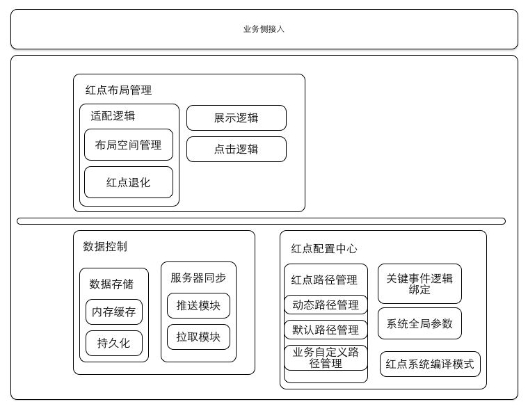
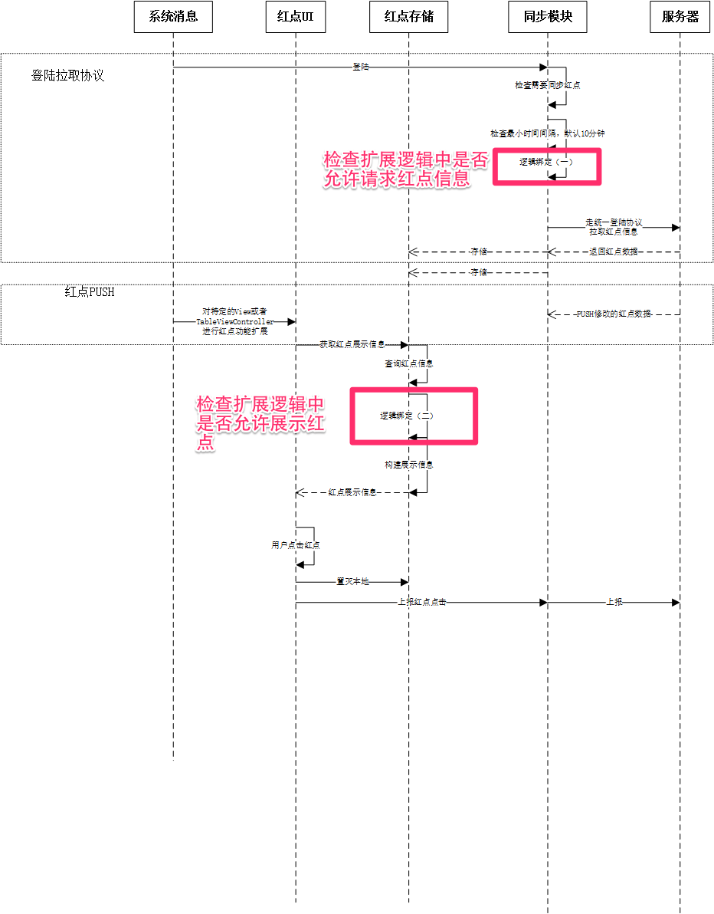

#红点系统（IOS）概述

从5.4版本开始，对整个红点的架构进行了梳理。通过模块化的方法，将各主体功能进行了解耦，并且通过AOP等技术大幅度简化了业务的接入流程。现在对5.4版本之后的红点系统（IOS）端做一个概述。

##综述


对于红点系统来讲其主体功能主要是负责从服务器同步红点数据，并且根据各红点的信息将其展示在界面上，在用户点击之后将红点状态与服务器同步。

而从编程或者业务使用者的角度来讲，只要提供相应的红点的Path就可以了，即告诉红点系统在界面上的某个地方有个红点，其他的事情红点系统来完成。


我们在5.4版本迭代的时候，确立了红点系统演化的基本原则（所谓基本规则即是后续功能演化的基础和最好去遵守的一些原则），其实确立这些原则的初衷，一是为了在思考的时候有所依据，二是为了控制复杂性（红点系统是一个逻辑异常复杂，场景异常多的系统，对于这样一个系统来言，如果没有合理的控制整个系统的复杂度，后期的维护成本将会异常巨大）。

这几个基本原则有：

1. 红点系统中的控制逻辑，尽可能的服务器决定，客户端尽可能只负责UI相关的逻辑。
2. 各个红点之间从客户端的角度来讲是独立的（如果要实现联动，红点系统不负责，由需要业务自己开发，红点系统只负责提供基础能力）
3. 业务尽可能不要关心红点系统的同步、控制、上报逻辑，这些对于业务透明
4. 减少版本之间的差异，依赖配置优于迭代的原则，将可能的变动通过配置的方式来实现，防止版本之间的变化过大，造成维护成本上升。
5. 模块化开发
6. 业务接入界面尽可能的简单，尽可能将系统的变化控制在系统内部，减少对业务接入方的影响

###主要模块

遵循这几个原则和参照系统的功能要求我们将整个系统分成了四个主体模块

1. 数据控制模块，负责数据的同步和存储
2. 红点布局管理模块，负责红点的UI展示和其他UI相关的逻辑
3. 业务接入模块，提供也无妨接入的接口界面
4. 红点配置中心，负责红点系统的整体控制

四个主题模块各司其职，互相配合，完成红点系统在IOS客户端的功能。

###红点功能介绍
我们先来简单看一下红点系统的整体的时序图，以对红点系统的功能有个初步的了解。



红点系统首先通过与服务器同步（协议存放在protocols目录下面），来获取所需要的信息。其中主要有两种获取途径：

1. IOS客户端从服务器来去，这里有一个10分钟最小间隔限制。其拉取的触发时机是每次用户登陆的时候，会拉取当前登陆用户要在IOS客户端展示的红点，而并非每次登陆都会拉取，如果两次登陆之间的时间间隔小于10分钟，则不会触发拉取行为。
2. 服务器推送，走的SSO的push通道，当服务器发现有新的红点的时候，主动push红点数据，这种功能需要业务方配合使用，并不是所有的红点都会主动PUSH，只有接入PUSH通道的才会。

其中同步的主要数据是结构是：

```
//单个业务信息
message AppInfo{
   optional uint32 uiAppId = 1;               //业务ID
   optional int32 iNewFlag = 3;               //new标签展示标记 0-不展示  1-展示 （请求包为本地当前的new展示信息）
   optional uint32 type = 4;                  //类型，0为红点, 1为NEW, 2为红点数字, 3为异形红点, 4为文字红点
   optional string buffer = 5;                //扩展字段
   optional string path = 6;                  //level1.level2.level3.level4;
   optional uint32 modify_ts = 7;             //修改时间， 在iNewFlag变更时更新
   repeated string missions = 8;              //节点对应的任务列表
   optional int32 appset = 9;                 //业务集合 0为动态 1为我 2为其他 3为虚拟
   optional int32 num = 10;                   //type == 2时有效，红点数字
   optional string icon_url = 11;             //红点icon url
   optional int32 icon_flag = 12;             //异形红点图片加红点标记 0-不加 1-加
   optional int32 icon_type = 13;            //异形红点类型 0-普通 1-头像
   optional uint32 push_red_ts = 14;         //实时上报红点获取红点的时间
   optional int32 mission_level = 15; //红点投放的基本0----我和动态， 1----1级, 2.....
   optional RedDisplayInfo red_display_info = 16; //红点
};
```

需要特别强调的是：其中RedDisplayInfo提供红点的展示信息，buffer用来让也无妨能够携带一些红点相关的数据（也无妨在开发业务的时候，尽量不要太依赖buffer，这里会造成整个协议包增大，超过SSO限制，以致丢包的问题）

客户端在获取到需要展示的红点信息之后，首先会更新红点的内存缓存和持久化存储。

红点的内存缓存，缓存了红点的所有信息，只有在配到新数据到达的情况下，才会进行一次持久化存储，也就是说缓存中的数据基本原则是和持久化保持一致，但是遇到数据更新的时候，优先更新缓存再去更新持久化存储。而持久化存储的作用，只是在程序第一次启动的时候，更新缓存用，因为这个系统还没有与服务器同步，需要依赖持久化中的数据来为整个红点系统提供数据支撑。

当红点系统从服务器获取到新的数据之后，会通过抛消息的方式通知界面界面进行更新。

界面在捕获响应的通知消息之后，会从内存缓存中取出对应的红点信息进行展示。因为红点有不同的展示样式，而iphone也存在屏幕大小不一致的问题。所以在展示的时候，会首先判断当前提供给展示红点的区域是否能够完美的展示出红点来，如果不能则将进行退化处理，以适应当前的区域。

展示完成之后，将会在界面上出现相应的红点。用户点击之后，红点系统会消掉当前的红点，并将用户的点击行为进行上报，与此同时与服务器同步当前红点的点击状态。

到此完成了一次红点的展示流程。


##主要模块设计思路描述

###数据同步模块
数据同步负责与服务器之间的通讯和数据的存储，同步走的SSO协议，存储用的NSUserDefaults，这里面没有太多需要赘述的东西，查看相应代码即可明白。
###红点布局管理模块
负责红点的UI展示和其他UI相关的逻辑。
####可扩展的展示与布局系统
为了支持可扩展的运营能力，让客户端的提醒能力不止局限于红点。可以是简单的

1. 
2. 
3. ...

这种单个红点，也可以是多种类型的复合型红点


我们使用了一个简单可扩展的布局系统，类图如下：


主要有两种类型组成定长的RPFixSpaceItemView和不定长的RPUnFixSpaceItemView。在展示红点的时候，会获取一个用来展示红点的区域（CGRect），然后按照填满的策略，将上述两种类型布局在这段区域内。


同时每种类型支持不同的展示信息，以来调整其界面样式。

RPItemView通用属性
bg_color 背景色

RPImageItemView支持属性：
is_avatar 是否是头像
use_side_dot 是否在右上角添加红点

RPTextItemView 
color 前景色
corner_color 圆角的颜色

####退化原则
因为红点属于辅助性提醒工具，所以一个基本原则，就是尽可能不影响原有的界面的展示或布局。因为当取到的用于展示红点的空间不足的情况下，会进行退化处理。退化会遵循以下算法：

1. 当空间不足的情况下，若存在多个红点则向单一红点退化。
2. 当只有一个红点时，如果依旧空间不足，则向小红点退化。退化之后，还是不足，则退化成不展示红点。


###业务接入界面设计思路
整体接入流程：

1. 接入流程  
	申请红点路径，具体找产品lilianliu。  
 	对客户端进行代码层接入。
2. 代码层接入流程.RPConfigCenter为红点主要配置类，绝大部分配置相关的工作将会在此类中进行。

####客户端中登记所申请的红点的信息
对于动态Tab中的插件，进行接入无需填写该信息。动态Tab之外的则需要登记相关信息。
在defaultAppInfos函数中使用宏RPDefaultAppInfo增加你申请到红点的信息，

```
/**
 *  需要在客户端配置的红点信息
 *
 *  @param appset  改红点所属的页面的Tab归类
 *  @param appid   申请到的红点系统的业务ID
 *  @param appPath 需要下发的红点的路径信息
 *  @param desp 红点描述性信息
 *
 */
#define RPDefaultAppInfo(appset, appid, appPath , desp)  [[ValueAddedServiceAppInfo alloc] initWithAppId:appid path:@""#appPath appSet:appset]
```

例如增加群与活动的红点：

```
- (NSArray*) defaultAppInfos
{
    NSArray* appInfo =
  @[
    RPDefaultAppInfo(1, 887, 887, 群与活动),
    ...
    ];

   return appInfo;
}
```
业务代码处添加展示代码
此次改造的重点就是UI层接入简化。现在基本上使用较少的代码就可以将红点展示出来。

TableView相关业务的红点展示
在TableViewController的viewDidLoad函数中，使用函数```void QQExtendTableViewControllerRedPoint(id<QQRedPointTableViewControllerDelegate> origin);```对当前的ViewController进行红点展示逻辑的扩展。该函数接受一个实现了QQRedPointTableViewControllerDelegate的对象

```
@protocol QQRedPointTableViewControllerDelegate <NSObject>
@required
/**
 *  获取需要扩展的UITableView
 *
 *  @return 需要扩展的UITableView
 */
- (UITableView*) redPointTableView;
@required
/**
 *  获取在对应IndexPath处要展示的红点的路径信息
 *
 *  @param tableView 被扩展的UITableView
 *  @param indexPath 要展示红点的indexPath
 *
 *  @return 在对应IndexPath处要展示的红点的路径信息
 */
- (NSString*) tableView:(UITableView*)tableView redPointPathForIndex:(NSIndexPath*)indexPath;
@end
```
例如对于“QQRecommendViewController”扩展红点功能：

```
@interface QQRecommendViewController()<QQRedPointTableViewControllerDelegate>
        ....
@end
....
- (void) viewDidLoad
{
    [super viewDidLoad];

    QQExtendTableViewControllerRedPoint(self);
}
...
- (UITableView*) redPointTableView {
    return self.tableView;
}

- (NSString*) tableView:(UITableView*)tableView redPointPathForIndex:(NSIndexPath*)indexPath
{

    NSMutableArray * subGroups = [_dataSources objectAtIndex:[indexPath section]];
    if ([indexPath row] >= [subGroups count])
        return nil;
    if (indexPath.section == 0) {
        return nil;
    }
    QQTableCellItem * item = [subGroups objectAtIndex:[indexPath row]];

    return [NSString stringWithFormat:@"%d", item.resID];
}
```

UIView及其子类进行红点扩展
使用QQExtendViewRedPoint对需要进行红点展示的View进行扩展，（切结此处的View必须是不会被多个界面复用的view，否则会产生混乱）

```
   /**
    *  对一般不服用的View进行红点扩展
    *
    *  @param origin               需要进行红点扩展的View
    *  @param path                 对应红点的路径
    *  @param layoutBlock          对红点进行布局的BLock
    *  @param usingDefaultTapLgoic 是否是使用默认的，点击逻辑，对红点进行点灭和上报操作
    */
   void QQExtendViewRedPoint(UIView* origin,
                             NSString* path,
                             QQRedPointLayoutBlock layoutBlock,
                             BOOL usingDefaultTapLgoic);
例如扩展动态上面三个横向布局的Button:

QQExtendViewRedPoint(button, [NSString stringWithFormat:@"%d", item.resID], ^(UIView *originView, NSArray* layoutViews) {

    DynamicTopEnterButton* btn = (DynamicTopEnterButton*)originView;
    RPItemView* item = layoutViews.lastObject;
    CGSize itemSize = [item layoutSize];
    CGFloat middleX = CGRectGetMidX(btn.imageView.frame);
    CGRect rect =  CGRectMake(middleX, CGRectGetMinY(btn.imageView.frame), itemSize.width, itemSize.height);
    item.frame = rect;
}, YES);
```
业务自定义逻辑扩展
在某些特殊情况下，对于红点是否请求，以及红点是否展示，各个业务可能会加入一些自己的判断逻辑在里面。为了应对这种变动，特意在RPConfigCenter里面做了逻辑绑定的接口。在几个特殊的环境，给业务进行逻辑扩展的能力。 下图是整个红点的时序图： 


是否请求红点信息 (时序图逻辑绑定一)
在某些情况下，某个业务可能会要求红点系统不必要向服务器请求红点的数据，遇到该类问题可以在RPConfigCenter里面添加业务的逻辑。 在函数defaultBindingCheckCanRequest,使用函数```- (void) bindingCheckCanRequestBlock:(RPCheckPathCanRequestBlock )block toPath:(NSString *)path```进行逻辑绑定。例如：

```
- (void) defaultBindingCheckCanRequest
{
    [self bindingCheckCanRequestBlock:^BOOL(NSString *path) {
        TeleEntryModel *teleEntry = [[serviceFactoryInstance() getTeleHallService] getTeleEntryModel];
            if ([(NSNumber*)path intValue] == ValueAddedServicePluginIDMyTeleHall && !teleEntry.showEntry) {
                QQ_EVENT("红点系统:营业厅入口不展示，所以不需要显示营业厅的红点");
                return NO;
            }
        return YES;
    } toPath:[@(ValueAddedServicePluginIDMyTeleHall) stringValue]];

}
```
是否展示数据（时序图逻辑绑定二）
在某些情况下，业务可能希望及时拉到了红点的数据，也不需要进行展示。那么可以在defaultBindingCheckCanShow使用函数```- (void) bindingCheckCanRequestBlock:(RPCheckPathCanRequestBlock )block toPath:(NSString *)path```进行逻辑绑定。

其中RPCheckPathCanRequestBlock闭包返回类型为BOOL类型。

如果需要在其他红点的整个流程中进行逻辑绑定扩张，请联系对应开发，切记不要随意在红点流程中添加业务逻辑。


####切面范式（AOP）
OOP只能沿用继承树德纵向方向重用，而AOP则弥补了OOP的不足，可以在横向方向上重用。如果一个程序是一个管道系统，AOP就是在管道上钻一些孔，在每个孔中注入新的代码流。而我们要实现上面的改造目标，就是要在不改变现有代码的基础上，进行依赖注入。动态的将红点的业务逻辑注入到现有的UI界面之重。以当前需要接入红点的UI类作为接入点，进行编织。

更多关于切面范式的信息可以参见《冒号学堂》一书。

####runtime

#####isa-swzzing
oc是一门动态语言，而且很多动态的特性都得利于其Runtime的技术。在这里我们使用了一种与runtime有关系的技术```isa-swzzing```。在Runtime中OC的表示实例(```instance```)的数据结构中有一个指针```isa```，其指向了当前实例对应的类。


```
typedef struct objc_object {
    Class isa;
} *id;
```

当你改变isa指针的时候，将会改变当前实例所属的类。

于是我们利用这种特性可以动态的改变一个实例所需的类。来改变实例的行为。

######动态创建类
runtime的一个好处就是，你可以在程序运行时，任意的改变所有OC的结构。在改造红点UI的时候还用到另外的一种技术——动态创建虚拟类。

比如我们要扩展一个UITableViewController，我们会从UITableViewCtroller继承一下，生成一个虚拟的类UITableViewCtroller_RedPoint。并且会将另外一个专门用来提供方法实现的类的所有方法拷贝到当前的类中，以实现给UITableViewCtroller_RedPoint增加功能的目的。

这里有一个问题是提供方法的类的父类不是UITableViewController，所以在他的那些方法中如果调用[super xxxx]的话，将不能够顺利的调用到UITableViewController对应的方法上面。于是在这里我们使用```objc_msgSendSuper```直接调用父类的对应方法。


核心的类替换代码如下：

```
void QQExtandClass(id origin, NSString* subclassName, Class providerClass) {
    if (!origin) {
        return;
    }
    NSString* originClassName = NSStringFromClass([origin class]);
    
    Class cla = NSClassFromString(subclassName);
    if(cla) {
        object_setClass(origin, cla);
        if ([origin respondsToSelector:@selector(setOriginClassName:)]) {
            [origin performSelector:@selector(setOriginClassName:) withObject:originClassName];
        }
        return;
    };
       
    Class providerClassLocal = [DZSwizzing subclass:[providerClass class] usingClassName:[NSString stringWithFormat:@"%@-%@",NSStringFromClass(providerClass), NSStringFromClass([origin class])] providerClass:providerClass];
    class_setSuperclass(providerClassLocal, [origin class]);
    cla = [DZSwizzing subclass:[origin class] usingClassName:subclassName providerClass:providerClassLocal];
    if (cla) {
        object_setClass(origin, cla);
    }
    if ([origin respondsToSelector:@selector(setOriginClassName:)]) {
        [origin performSelector:@selector(setOriginClassName:) withObject:originClassName];
    }
}
```

调用父类方法：


```
id QQsendSuperSelector(NSObject* object, SEL selector) {
    NSString* className;
    if (class_respondsToSelector( object_getClass(object), @selector(originClassName))) {
        className = [object performSelector:@selector(originClassName)];
    } else {
        return nil;
    }
    
    Class superClass = NSClassFromString(className);
    
    if (class_selfHasSelector(superClass, selector))
    {
        struct objc_super s;
        s.receiver = object;
        s.super_class = superClass;
        objc_msgSendSuper(&s, selector);
        return nil;
        
    } else {
        NSLog(@"can't send the selector to super");
        return nil;
    }
}
```

####实现逻辑：
#####UITableViewController接入红点的改造

一个大概的实现框架思路如下：


(1) 扩展UITableViewCell的功能实现对红点相关View的展示和布局的注入。将QQExtendTableViewCellProvider的函数功能注入到其中。
  
```


@implementation QQExtendTableViewCellProvider
IMP_QQExtendProviderMethods

- (void) layoutSubviews
{
    QQsendSuperSelector(self, @selector(layoutSubviews));
    
#define RemoveSubViewWithTag(tag) UIView* __subview = [self.contentView viewWithTag:kRedPointTagDot]; \
    [__subview removeFromSuperview];
    
    RedPointShowInfo* showInfo = [self.redPointItemExtend getRedPointShowInfo];
    showInfo.isShowRedPoint = YES;
    showInfo.hintType = VASHintTypeNew;
    
    static int const ViewTagArrayLength = 5;
    static int ViewTagArray[ViewTagArrayLength] =
    {
        kRedPointTagDot,
        kRedPointTagNum,
        kRedPointTagNew,
        kRedPointTagIcon,
        kRedPointTagWord
    };
    
    int currentTag = ViewTagFromHintType(showInfo.hintType);
    for (int i = 0; i < ViewTagArrayLength; i++) {
        int tag = ViewTagArray[i];
        if (currentTag != tag) {
            RemoveSubViewWithTag(i);
        }
    }
    
    UIView* redPointView = nil;
    if (showInfo.isShowRedPoint) {
        switch (showInfo.hintType) {
            case VASHintTypeNum:
                redPointView = [self __layoutRedNum:showInfo];
                break;
            case VASHintTypeDot:
                redPointView = [self __layoutRedDot];
                break;
            case VASHintTypeWord:
                redPointView = [self __layoutRedWord:showInfo];
                break;
            case VASHintTypeNew:
                redPointView = [self __layoutNew];
                break;
            case VASHintTypeIcon:
                
            default:
                break;
        }
    } else {
        if (currentTag != NSNotFound) {
            RemoveSubViewWithTag(currentTag);
        }
    }
    if ([self respondsToSelector:@selector(didLayoutView:withRedPointInfo:)]) {
        [self didLayoutView:redPointView withRedPointInfo:showInfo];
    }
}


#define CellContentWidth CGRectGetWidth(self.contentView.frame)
#define CellContentHeight CGRectGetHeight(self.contentView.frame)

-  (UIView*) __layoutRedDot
{
    UIImageView* view = (UIImageView*)[self.contentView viewWithTag:kRedPointTagDot];
    if (!view || ![view isKindOfClass:[UIImageView class]]) {
        view = [UIImageView new];
        view.tag = kRedPointTagDot;
        UIImage* dotImg = LOAD_ICON_USE_POOL_NO_CACHE(@"red_dot_middle.png");
        view.image = dotImg;
        [self addSubview:view];
    }
    
    UIImage* image = view.image;
    view.frame = CGRectMake(CellContentWidth - 15 - image.size.width,
                                  (CellContentHeight - image.size.height)/2.0f + 0.5f,
                                  image.size.width,
                                  image.size.height);
    
    return view;
}

- (UIView*) __layoutNew
{
    UIImageView* _rpNewView = (UIImageView*)[self.contentView viewWithTag:kRedPointTagNew];
    if (!_rpNewView || ![_rpNewView isKindOfClass:[UIImageView class]]) {
        UIImage* tipImg =  LOAD_ICON_USE_POOL_NO_CACHE(@"tab_new.png");
        _rpNewView = [[UIImageView alloc] initWithFrame:CGRectZero];
        _rpNewView.image = tipImg;
        _rpNewView.tag = kRedPointTagNew;
        [self.contentView addSubview:_rpNewView];
    }
    
    UIImage* image = _rpNewView.image;
    _rpNewView.frame = CGRectMake(CellContentWidth - 15 - image.size.width,
                                  (CellContentHeight - image.size.height)/2.0f + 0.5f,
                                  image.size.width,
                                  image.size.height);
    return _rpNewView;
}

- (UIView*) __layoutRedNum:(RedPointShowInfo*)showInfo
{

    QQMessageReadTagView* messageView = (QQMessageReadTagView*)[self.contentView viewWithTag:kRedPointTagNum];
    if (!messageView || ![messageView isKindOfClass:[QQMessageReadTagView class]]) {
        messageView = [[QQMessageReadTagView alloc] initWithFrame:CGRectZero];
        messageView.tag = kRedPointTagNum;
        messageView.image = LOAD_ICON_USE_POOL_NO_CACHE(@"red_dot_big.png");
        messageView.backgroundColor = [UIColor clearColor];
        //
        [self.contentView addSubview:messageView];
    }
    messageView.unreadCount = showInfo.rpNumber;
    CGSize textSize = [messageView getFitSize];
    messageView.frame = CGRectMake(CellContentWidth - 15 - textSize.width,
                                ABS(CellContentHeight- textSize.height)/2,
                                textSize.width,
                                textSize.height+1);
    return messageView;

}

- (UIView*) __layoutRedWord:(RedPointShowInfo*)showInfo
{
    QQMessageWordView* wordView = (QQMessageWordView*)[self.contentView viewWithTag:kRedPointTagWord];
    if (!wordView || ![wordView isKindOfClass:[QQMessageWordView class]]) {
        wordView = [QQMessageWordView new];
        wordView.tag = kRedPointTagWord;
        [self.contentView addSubview:wordView];
    }
    wordView.wordText = showInfo.hintWord;
    CGSize textSize = [wordView getFitSize];
    wordView.frame = CGRectMake(CellContentWidth - 15 - textSize.width,
                                ABS(CellContentHeight- textSize.height)/2,
                                textSize.width,
                                textSize.height);
    return wordView;
}

@end

```

注入功能的函数与功能如下：

```
void QQExtendTableViewCellRedPoint(NSObject* origin)
{
    NSString* subclassName = [NSString stringWithFormat:@"%@_redpoint",NSStringFromClass([origin class])];
    QQExtandClass(origin, subclassName, [QQExtendTableViewCellProvider class]);
}


```

(2) 扩展UITableViewController的功能，实现对红点亮灭逻辑的注入。将包含红点处理逻辑的QQExtendTableViewControllerProvider的功能注入其中。

```
@interface QQExtendTableViewControllerProvider ()

@end

@implementation QQExtendTableViewControllerProvider

IMP_QQExtendProviderMethods;


- (UITableViewCell *)tableView:(UITableView *)tableView cellForRowAtIndexPath:(NSIndexPath *)indexPath
{
    UITableViewCell* cell = (UITableViewCell*) QQsendSuperSelectorWithArgs2(self, @selector(tableView:cellForRowAtIndexPath:), tableView, indexPath);

    if ([self respondsToSelector:@selector(tableView:redPointPathForIndex:)]) {
        NSString* path = [self tableView:self.tableView redPointPathForIndex:indexPath];
        if (path) {
            if (cell) {
                QQExtendTableViewCellRedPoint(cell);
                QQExtendTableViewCellProvider* provider = (QQExtendTableViewCellProvider*)cell;
                RedPointItemForCell* item = [[ValueAddedServiceUpdateCenter sharedInstance] getRedPointItemByPath:path andAppSet:0];
                provider.redPointItemExtend = item ;
            }
        }
    }
    return cell;
}

- (void) tableView:(UITableView *)tableView didSelectRowAtIndexPath:(NSIndexPath *)indexPath
{
    QQSendSuperSelectorWithArgs2NoReturn(self, @selector(tableView:didSelectRowAtIndexPath:), tableView, indexPath);
    UITableViewCell* cell = [self tableView:self.tableView cellForRowAtIndexPath:indexPath];
    QQExtendTableViewCellProvider* provider = (QQExtendTableViewCellProvider*)cell;
    RedPointItemForCell* item = provider.redPointItemExtend;
    [item hideRedPoint];
    
}

@end
```

注入功能的函数如下：

```
void QQExtendTableViewControllerRedPoint(id<QQRedPointTableViewControllerDelegate> origin)
{
    NSString* subclassName = [NSString stringWithFormat:@"%@_redpoint",NSStringFromClass([origin class])];
    QQExtandClass(origin, subclassName, [QQExtendTableViewControllerProvider class]);
}
```

改造之后业务接入红点只需要两个步骤：

（1） 在ViewDidload中调用下述函数，注入红点相关功能
```
QQExtendTableViewControllerRedPoint(self);
```

（2）实现下属函数，返回对应indexpath的红点path   

```
 - (NSString*) tableView:(UITableView *)tableView redPointPathForIndex:(NSIndexPath *)indexPath
{
    if (indexPath.section == 1 ) {
        QQTableCellItem* item = [[_dataSources objectAtIndex:indexPath.section] objectAtIndex:indexPath.row];
        if (item) {
            return item.redPointKey;
        } else {
            return nil;
        }
    }
    return nil;
}
```


###红点配置中心
负责红点系统的整体控制，主要有业务的逻辑绑定，客户端中所有红点path的管理，以及红点的全局参数等等。

同时还负责，红点的编译参数的设定。红点编译有三个环境

1. 正式环境，当上线applestore的时候，需要设置成该环境。
2. DEBUG环境，开发debug的时候使用，打开此环境的是偶RPDebugCenter内的代码将会被编译，在这里面可以进行各种debug操作。
3. TEST环境，自动化测试的环境

